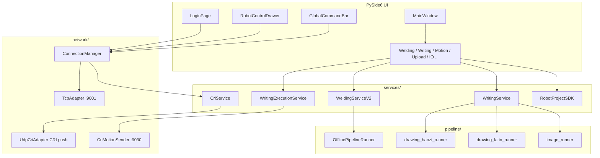

# Codroid 机器人控制终端 — 架构说明

> 文档版本：2026-05（与当前源码同步）  
> 机器人通信协议详见根目录 **`planAPI.md`**（唯一保留的 API 交接文档）。

---

## 1. 项目定位

本仓库是 **Codroid 六轴机器人上位机**：PySide6 桌面应用，集成：

- 登录与 TCP/UDP/CRI 连接管理；
- 全局示教器式点动、使能、工程控制；
- **焊接页**：轮廓/骨架字 → Lua + 工艺段；
- **绘图页**：轮廓/Hershey 拉丁骨架/汉字 medians/图片轮廓 → CRI 轨迹 UDP 下发；
- **运动页**：节点连线式运动编排（类 ComfyUI）；
- **上传页**：HTTP/WS 工程上传与槽位绑定；
- IO / 寄存器监控。

离线轨迹生成（`pipeline/`）与 Qt UI 分离，便于单测与批处理；**禁止**在 UI 线程直接操作 socket。

---

## 2. 技术栈

| 类别 | 选型 |
|------|------|
| UI | PySide6 6.5+ |
| 3D 预览 | PyOpenGL 2.1 Compatibility + pygltflib |
| 数值/图像 | NumPy、OpenCV、Pillow、scikit-image、matplotlib |
| 配置 | PyYAML、QSettings（`Codroid` / `RobotUI`） |
| 单线字 | Hershey-Fonts（pypi） |
| 汉字骨架 | MakeMeAHanzi `graphics.txt`（本地 `third_party/makemeahanzi/`） |
| 上传 | requests + websocket-client → `RobotProjectSDK` |
| Python | 建议 3.11（`.venv`） |

---

## 3. 目录结构

```text
UI/
├── main.py                 # 入口：OpenGL、日志、服务、bind_all、事件循环
├── planAPI.md              # 机器人 TCP/UDP/工程 API（勿删）
├── requirements.txt
├── app/                    # Qt 壳层
│   ├── bootstrap.py        # Login + MainWindow 堆叠
│   ├── main_window.py      # 顶栏/页面区/抽屉/命令栏/菜单
│   ├── page_registry.py    # 页面注册表
│   ├── page_router.py      # 懒加载、on_enter/on_leave
│   ├── signal_binder.py    # 全部 UI↔网络 信号集中绑定
│   ├── service_provider.py # cm + cri 注入页面
│   ├── i18n.py             # 中英双语
│   ├── pages/              # 功能页
│   └── widgets/            # 顶栏、命令栏、抽屉、节点编辑器等
├── core/                   # 无 Qt 依赖的类型、日志、单位、连接配置
├── network/                # TCP 适配器、ConnectionManager、UDP CRI、CRI 发包
├── services/               # 业务服务（焊接/绘图/执行/CRI/上传 SDK）
├── pipeline/               # 离线轨迹：栅格→路径→映射→工艺/CRI 导出
├── config/                 # 默认参数、字体预设、robot_models.yaml
├── models/                 # 首页 3D 预览用 GLB（根目录，非 assets）
├── view3d/                 # GLB 加载与 OpenGL 预览
├── styles/                 # QSS 主题
├── third_party/            # 大数据（gitignore）：makemeahanzi 等
├── docs/                   # NOTICE、历史 HANDOFF
├── tools/                  # mock_robot_server 等开发工具
└── output/                 # 运行生成（预览、轨迹、Lua，通常不入库）
```

---

## 4. 启动与运行时对象

```text
main()
  ├─ setup_logger("codroid")          → logs/YYYYMMDD.txt
  ├─ create_app_stack()                 → QStackedWidget: LoginPage | MainWindow
  ├─ ConnectionManager()                UI 线程，管理 TcpThread + 重连
  ├─ CriService(cm)                     UDP 绑定 + Start/StopDataPush
  ├─ RobotService(cm)                   薄封装（预留）
  ├─ NodeEditorWidget.set_global_send_callback(cm.send_call)
  ├─ ServiceProvider(cm, cri) → PageRouter
  └─ bind_all(cm, cri, login, main_win, stack)
       └─ aboutToQuit → cri.stop(), cm.disconnect(), 停止 Jog/moveTo 心跳
```

**页面访问后端**：`page._service_provider.cm` / `.cri`（在 `PageRouter.navigate` 首次注入）。

---

## 5. 线程与跨线程规则

| 组件 | 线程 | 说明 |
|------|------|------|
| 所有 QWidget | UI 主线程 | 禁止子线程直接改控件 |
| `TcpThread` + `TcpAdapter` | 独立 QThread | connect/send 经 `@Slot`；`data_received` Signal → UI |
| `UdpThread` + `UdpCriAdapter` | 独立 QThread | bind 本地 IP:port；308B 帧解析后 Signal → UI |
| `ConnectionManager` | UI | pending 请求、订阅分发、重连退避 1→2→4→8s |
| `WritingExecutionService` | QThread worker | CRI 轨迹 UDP 发送，日志 Signal 回 UI |
| `WeldingServiceV2` / `WritingService` | 多在 UI 调 pipeline | pipeline 本身无 Qt |

**硬性约定**（维护时勿破）：

1. UI → 网络：仅 `cm.send_call` / `send_raw` / `send_subscribe`。  
2. 点动/RunTo：**按下**发 `Robot/jog` 或 `Robot/moveTo`，**500ms** `*Heartbeat`，**松开**停心跳并 `stopJog` 或 `moveTo type=-1`。  
3. CRI 推送：连接成功后先 `CRI/StopDataPush`，再 `CRI/StartDataPush`（`duration=2` ms，500Hz）。  
4. 绘图执行：先 TCP `CRI/StartControl`，再 UDP **64B** 包发到机器人 **:9030**（与本地 CRI 推送端口不同）。

---

## 6. 通信架构

```text
                    ┌─────────────────┐
                    │   LoginPage     │
                    │ robot_ip        │
                    │ local_ip:port   │
                    └────────┬────────┘
                             │ ConnectionConfig
                             ▼
┌──────────────────────────────────────────────────────────────┐
│ ConnectionManager (UI)                                        │
│  TcpThread → TCP :9001  JSON 请求/响应/订阅                    │
│  重连弹窗、pending、publish/* 分发                             │
└────────────┬─────────────────────────────┬───────────────────┘
             │                             │
             ▼                             ▼
┌────────────────────┐         ┌────────────────────┐
│ CriService         │         │ 各页 send_call      │
│ UdpThread bind     │         │ Jog/moveTo/IO/节点   │
│ StartDataPush      │         └────────────────────┘
│ 308B 状态入站       │
└─────────┬──────────┘
          │ RobotRealtimeState / 抽屉位姿
          ▼
┌────────────────────┐         ┌────────────────────┐
│ WritingExecution   │         │ UploadPage          │
│ CRI/StartControl   │         │ RobotProjectSDK     │
│ UDP → :9030 轨迹    │         │ HTTP 9198 + WS 9000 │
└────────────────────┘         └────────────────────┘
```

- **协议细节**：见 `planAPI.md`（`ty` 字段、单位 mm+deg、错误码等）。  
- **上传**：不单独顶栏页；`services/robot_project_sdk.py` 封装 REST + WebSocket，由 **上传页** 调用。

---

## 7. UI 架构

### 7.1 主窗口布局

```text
┌─────────────────────────────────────────────────────────────┐
│ TopTabBar：首页 | 运动 | 焊接 | 绘图 | IO | 寄存器 | 程序 | 上传 │
├─────────────────────────────────────────────────────────────┤
│                                                             │
│  QStackedWidget（PageRouter 懒加载页面）                      │
│                                                             │
├─────────────────────────────────────────────────────────────┤
│ GlobalCommandBar：使能、模式、仿真、工程、停止运动…             │
├─────────────────────────────────────────────────────────────┤
│ StatusBar：连接、CRI、型号、模式…                             │
└─────────────────────────────────────────────────────────────┘
  RobotControlDrawer（左侧悬浮）：Jog、moveTo 预设、速度 70% 默认
```

### 7.2 页面注册（`app/page_registry.py`）

| key | 页面 | 说明 |
|-----|------|------|
| home | `HomePage` | 状态卡片 + GLB 模型预览 |
| motion | `MotionPage` | `NodeEditorWidget` 全屏编排 |
| welding | `WeldingPage` | 焊接生成 + moveTo 三点 + 送丝等 |
| writing | `WritingPage` | **绘图**（类名历史遗留） |
| io | `IoMonitorPage` | DI/DO/AI/AO 轮询 |
| register | `RegisterMonitorPage` | 寄存器卡片 |
| program | `ProgramEditorPage` | **占位**，未实现 |
| upload | `UploadPage` | Lua 上传/绑定，需已连接 |

已移除：独立 HTTP/WS/设置顶栏页（能力在上传页或主菜单语言/主题）。

### 7.3 路由生命周期

- `navigate(spec)`：旧页 `on_leave` → 懒加载 factory → 注入 `sp` → `on_enter`。  
- 切页触发 `on_stop_jog_requested`（停止全局点动）。  
- 退出：`persist_all_page_settings()` 调用各页 `_save_settings`（若存在）。

### 7.4 信号绑定（`app/signal_binder.py`）

集中绑定，避免 `main.py` 膨胀：

- 登录流、连接成功/失败、订阅 5 主题、错误弹窗清错；  
- 命令栏使能/模式/仿真/工程/停止运动；  
- 抽屉 `jog_pressed/released`、`moveto_pressed/released`、速度滑条；  
- CRI 帧 → `RobotRealtimeState` + 抽屉/首页位姿；  
- 重连对话框。

---

## 8. 焊接子系统

### 8.1 数据流

```text
WeldingPage._on_generate()
  → WeldingServiceV2.generate()
      → OfflinePipelineRunner.run(mode=contour|skeleton, ...)
           Stage 0   字高 → font_size_px
           Stage 1-2 栅格/轮廓或骨架提取
           Stage 3-5 clean → refine → schedule（多行 multiline_layout）
           5.5       layout_inset（左/上边距）
           Stage 6   PoseMapper + 溢出检测
           Stage 7   WeldingProcessPlanner → ProcessSegment
           Stage 8   points.txt / job.json / LuaExporter / preview PNG
```

### 8.2 正式能力

- **contour**：TTF 轮廓，支持 `\n` 多行、`char_spacing_mm` / `line_spacing_mm`。  
- **latin_stroke**：Hershey 单线（焊接骨架数字字母）。  
- **hanzi_stroke**：MakeMeAHanzi `medians`（`render_hanzi_text_to_strokes` → clean/refine/schedule → `WeldingProcessPlanner` → Lua），支持多行 `\n`。  
- 三点标定：**LT / RT / LB**（禁止用 RB 作输入）；Z 用 `z_work` / `z_safe`，**无 y_flip**。  
- 验收预览：**`preview_execution.png`**（纸面 UV，与 points/Lua 同源）。

### 8.3 关键文件

| 文件 | 职责 |
|------|------|
| `app/pages/welding_page.py` | UI、QSettings、生成、moveTo 三点、HoldButton 送气/送丝 |
| `services/welding_service_v2.py` | Qt Signal 包装 OfflinePipelineRunner |
| `pipeline/offline_runner.py` | 焊接离线主链 |
| `pipeline/process/weld_process.py` | 引弧/焊/收弧/空行程段 |
| `pipeline/output/lua_exporter.py` | `movL({cp={...}},{...})` + arcOn/Off |
| `config/welding_defaults.py` | 默认工艺与布局常量 |

---

## 9. 绘图子系统（`WritingPage`）

### 9.1 文字来源（`pipeline/text_pipeline.py`）

| text_source | 焊接 | 绘图 | 渲染 |
|-------------|------|------|------|
| ttf_contour | ✅ | ✅ | TTF 轮廓 |
| latin_stroke | ✅ | ✅ | Hershey medians |
| hanzi_stroke | ✅ | ✅ | MakeMeAHanzi medians |
| image_contour | — | ✅ | OpenCV 轮廓 |

### 9.2 汉字骨架

- 数据：`third_party/makemeahanzi/graphics.txt`（JSONL，字段 `medians`）。  
- 加载：`pipeline/hanzi/hanzi_data_loader.py`。  
- 渲染：`hanzi_stroke_renderer.py` → `Stroke`。  
- 执行链：`drawing_hanzi_runner.py` → `DrawingProcessPlanner` → `trajectory_cri.txt`。  
- **缺字硬错误**，无 TTF fallback。  
- hanzi-writer-data 已验证与 graphics.txt 同源，**不切换**。

### 9.3 CRI 执行

```text
WritingPage → WritingService.generate() → output/<ts>_.../
WritingPage → WritingExecutionService
  prepare: movL 到轨迹起点（TCP）
  execute: CRI/StartControl → CriMotionSender UDP :9030
```

诊断日志：`services/cri_execution_log.py`（毫秒中文、TCP 位姿 vs UDP 目标）。

最小 Z 测试：`services/cri_minimal_test.py`（不经过文字 pipeline）。

### 9.4 关键文件

| 文件 | 职责 |
|------|------|
| `app/pages/writing_page.py` | 绘图 UI、双模式文字/图片 |
| `services/writing_service.py` | 生成入口（latin/hanzi/image） |
| `services/writing_execution_service.py` | 后台执行 |
| `pipeline/drawing_latin_runner.py` | Hershey → CRI |
| `pipeline/drawing_hanzi_runner.py` | 汉字 medians → CRI |
| `pipeline/image_runner.py` | 图片轮廓 → CRI |
| `pipeline/process/drawing_process.py` | 落笔/抬笔 Z |

---

## 10. 运动节点编排

- 入口：`app/pages/motion_page.py` → `NodeEditorWidget`。  
- 模型：`widgets/node_editor/models.py`（`NODE_SPECS`、图 JSON）。  
- 校验：`graph_validator.py`；序列化：`graph_serializer.py`。  
- 执行：`execution_engine.py`（DryRun / 在线 MoveJ&L / IO / 寄存器 / If-For-While / Path-MoveC）。  
- 插件：`plugins/registry.py`、`plugins/builtin/`、`plugins/user/`。  
- TCP：经 `NodeEditorWidget.set_global_send_callback` → `cm.send_call`。  
- 宏：`macro_storage.py`、`macro_editor_dialog.py`。

**维护注意**：改节点类型需同步 `NODE_SPECS`、`node_catalog.LIBRARY_CATEGORIES`、执行引擎分支。

---

## 11. 核心领域模型（`core/types.py`）

- `RobotPoint`：mm + deg。  
- `WorkPlane`：TL/TR/LB 三点平面。  
- `Stroke` / `Path2D` / `Path3D`：笔画与路径。  
- `ProcessSegment`：焊接或绘图工艺段。  
- `PathConfig` / `WeldingProcessConfig` / `ImageDrawingConfig`：管线参数。  
- `ConnectionConfig`：登录参数（`core/connection_config.py`）。

单位转换：`core/unit_converter.py`（TCP/CRI rad/m ↔ UI mm/deg）。

---

## 12. 状态与配置持久化

| 存储 | 用途 |
|------|------|
| QSettings `Codroid/RobotUI` | 登录 IP、各页参数、节点编辑器布局 |
| `config/robot_models.yaml` | 机型名 → GLB/关节数 |
| `projects/*.json` | 节点图工程（用户保存） |
| `output/` | 每次生成的轨迹、预览、summary |

焊接/绘图页：400ms 防抖 `_save_settings` + `on_leave` + `aboutToQuit`。

---

## 13. 日志

- `core/logger.py`：文件 `logs/YYYYMMDD.txt`，>1MB 滚动；终端 WARNING+。  
- UI 日志：`app/ui_log.py` 桥接到 `QPlainTextEdit`。  
- CRI 执行：`cri_execution_log.py` 结构化中文轨迹诊断。

---

## 14. 扩展与修改指南

### 14.1 新增顶栏功能页

1. `app/pages/xxx_page.py` 继承 `BasePage`。  
2. `page_registry.py` 增加 factory + `PageSpec`。  
3. `top_tab_bar.py` 的 `TAB_I18N_KEYS` 增加 i18n key。  
4. `i18n.py` 补文案。  
5. 若需机器人 API：经 `self.sp.cm`，勿 new socket。

### 14.2 新增焊接/绘图文字源

1. `pipeline/text_pipeline.py` 增加常量与 `build_text_pipeline` 字段。  
2. 实现独立 runner 或扩展 `offline_runner` / `writing_service`。  
3. UI 下拉 `itemData` + QSettings。  
4. `summary.json` 的 `text_pipeline` 段保持一致。

### 14.3 新增节点类型

1. `models.NODE_SPECS`  
2. `execution_engine` 执行分支  
3. `node_catalog` 分类  
4. 可选：`plugins/` 自定义节点

### 14.4 禁止事项（历史教训）

- UI 线程操作 `QTcpSocket` / `QUdpSocket`。  
- 子线程 `setText` / 改 QWidget。  
- 点动/RunTo 做成单击而非按住。  
- 焊接输入 `right_bottom` 或恢复 `y_flip`。  
- 修改 Lua `movL` 为位置参数格式。  
- 最小化窗口触发 `reset_to_home`（仅用户主动回首页/登出）。

---

## 15. 占位与后续可选项

| 项 | 状态 |
|----|------|
| `program_editor` 顶栏页 | 占位 UI |
| 焊接 Beta 排版（对齐/方向/流向） | 仅 UI，未进 pipeline |
| 焊接 Beta：对齐/方向/流向 | 仅 UI，未进 pipeline |
| TCP :9002 远程脚本独立页 | 未做 |
| plan2 节点阶段 13–14（自定义节点完善、执行恢复增强） | 可按需继续 |

---

## 16. 相关文档

| 文档 | 内容 |
|------|------|
| `planAPI.md` | 机器人接口全集 |
| `README.md` | 安装、运行、功能概览 |
| `docs/NOTICE.md` | Hershey 字体许可 |
| `docs/HANDOFF_PHASE9.md` | 焊接 Phase 9 历史验收（部分测试脚本已删） |
| `third_party/makemeahanzi/README.md` | graphics.txt 放置说明 |

---

## 17. 架构图（总览）


